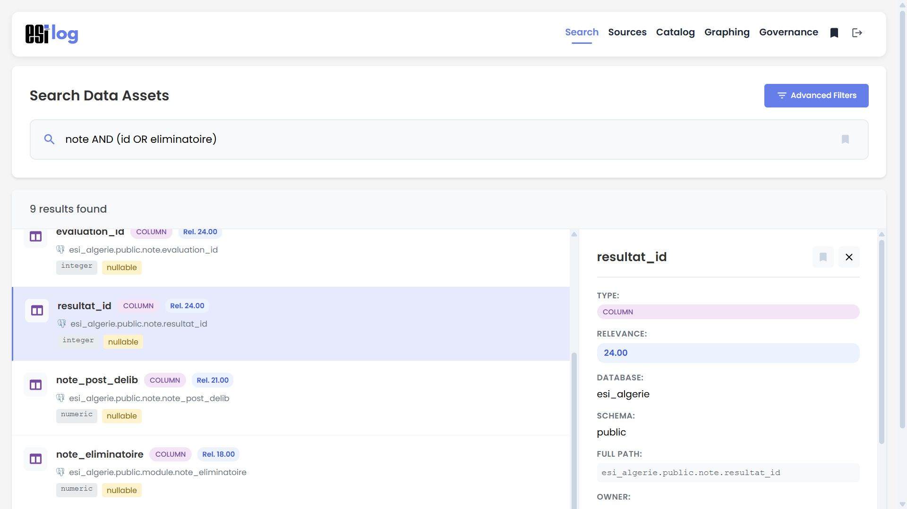
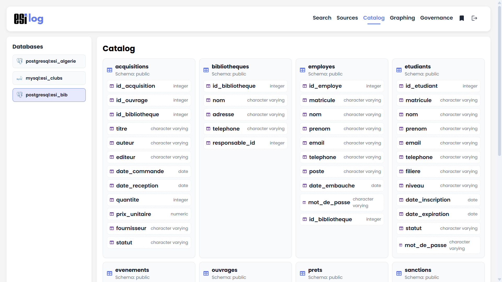
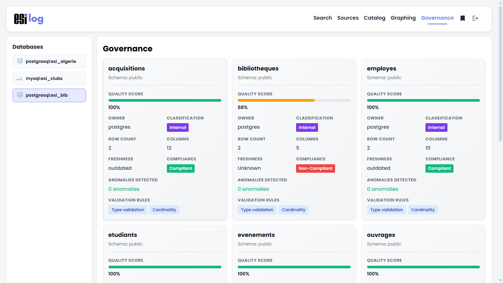
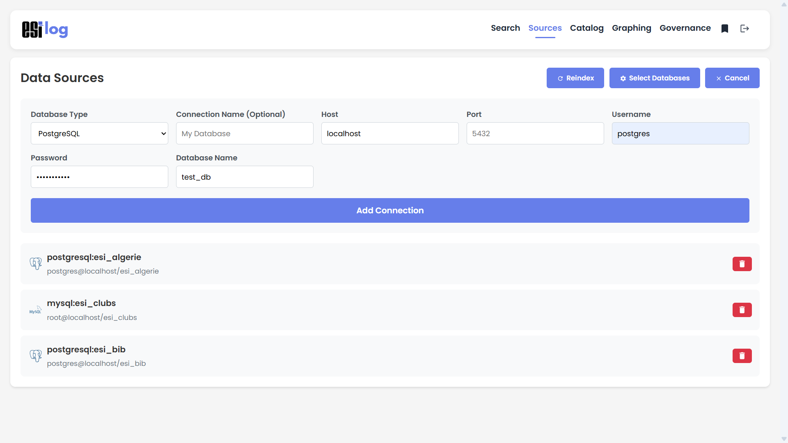
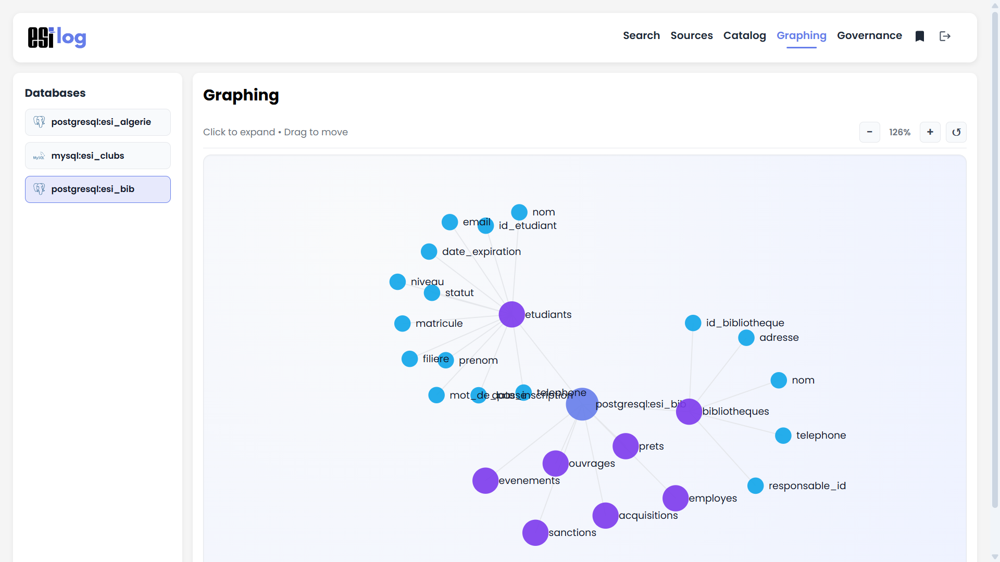
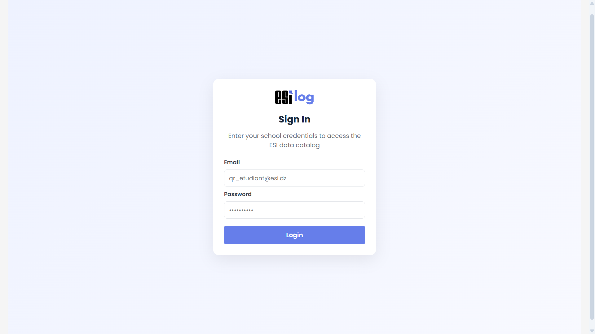

# ESILog

A comprehensive, modern data catalog application for discovering, managing, and governing database assets related to the Higher National School of Computer Science (ESI Alger) or any other type of assets across multiple data sources. Built with React, Express, and Elasticsearch.

## Features

### **Search & Discovery**
- Full-text search across tables and columns
- Advanced query syntax with AND/OR/NOT operators
- Real-time filtering by type, database, connection, and schema
- Relevance scoring for search results
- Save and bookmark frequently used searches



### **Catalog Management**
- Browse complete database schemas and table structures
- View column details including data types
- Organized hierarchical view of all assets
- Connection-based organization



### **Data Governance**
- Quality score tracking for each table
- Anomaly detection
- Compliance status (Compliant, At Risk, Non-Compliant)
- Classification tracking (Public, Internal, Restricted)
- Validation rule monitoring
- Owner and freshness tracking



### **Data Sources**
- Manage multiple database connections
- Support for PostgreSQL and MySQL
- Connection visibility preferences
- Reindex all databases with one click
- Secure credential management



### **Graph Visualization**
- Interactive network graph of databases, schemas, tables, and columns
- Expand/collapse nodes for detailed exploration
- Zoom and pan controls
- Drag-to-rearrange layout
- Connection-based filtering



### **Bookmarks & Favorites**
- Save favorite tables and columns
- Store complex searches for quick reuse
- Centralized favorites management

### **Authentication**
- Secure login system
- Session token management
- Protected routes



**Note**: Some functionalities (like authentication) are not fully implemented, as the project primarily focuses on data catalog features. However, their core structure is in place.

## Tech Stack

### Frontend
- **React** - UI framework
- **D3.js** - Interactive visualizations

### Backend
- **Node.js/Express** - Server framework
- **Elasticsearch** - Advanced search engine
- **PostgreSQL/MySQL** - Database support

## Project Structure

```
data_catalog/
├── frontend/                 # React application
│   ├── src/
│   │   ├── App.jsx          # Main application component
│   │   ├── index.css        # Global styles
│   │   ├── main.jsx         # Entry point
│   │   └── assets/          # Static assets
│   ├── index.html           # HTML template
│   ├── package.json         # Frontend dependencies
│   └── vite.config.js       # Vite configuration
│
├── backend/                  # Express server
│   ├── server.js            # Main server file
│   ├── connectionManager.js # Database connection handling
│   ├── searchService.js     # Search and indexing logic
│   ├── preferencesManager.js # User preferences
│   ├── package.json         # Backend dependencies
│   └── uploads/             # Temporary file uploads
│
├── .github/                 # Screenshots and assets
│   ├── login.png
│   ├── search.png
│   ├── catalog.png
│   ├── graphing.png
│   ├── governance.png
│   └── sources.png
│
└── README.md               # This file
```

## Getting Started

### Prerequisites
- Node.js (v14 or higher)
- npm or yarn
- PostgreSQL and MySQL databases

### Installation

1. **Clone the repository**
   ```bash
   git clone https://github.com/soualahmohammedzakaria/ESILog.git
   cd ESILog
   ```

2. **Setup Backend**
   ```bash
   cd backend
   npm install
   cp .env.example .env
   # Edit .env with your configuration
   npm run dev
   ```

3. **Setup Frontend**
   ```bash
   cd frontend
   npm install
   npm run dev
   ```

4. **Access the application**
   - Frontend: http://localhost:5173
   - Backend API: http://localhost:3001

## Configuration

### Backend (.env)
```env
PORT=3001

# PostgreSQL Connection
POSTGRES_DB_HOST=localhost
POSTGRES_DB_PORT=5432
POSTGRES_DB_USER=postgres
POSTGRES_DB_PASSWORD=12345
POSTGRES_DB_NAME=postgres

# MySQL Connection
MYSQL_DB_HOST=localhost
MYSQL_DB_PORT=3306
MYSQL_DB_USER=root
MYSQL_DB_PASSWORD=12345
MYSQL_DB_NAME=mysql
```

### Frontend
- API Base URL: Configured in `App.jsx` (default: `/api`)
- Update as needed for different backend endpoints

## Usage

### Adding a Database Connection
1. Navigate to **Sources** page
2. Click **Add Connection**
3. Select database type (PostgreSQL or MySQL)
4. Enter connection details (host, port, user, password, database)
5. Click **Add Connection**
6. Data will be indexed automatically

### Searching
1. Go to **Search** page
2. Use simple keywords or advanced syntax:
   - `users AND table` - Find results with both terms
   - `columns OR indexes` - Find results with either term
   - `NOT temporary` - Exclude results with this term
   - `users AND (table OR view) NOT temp` - Complex queries

### Managing Governance
1. Navigate to **Governance** page
2. Select a database connection
3. View quality scores, compliance status, and anomalies
4. Monitor freshness and validation rules

### Bookmarking
- Click the bookmark icon (⭐) on any search result or detail panel
- Access all bookmarks from the **Favorites** page

## Development

### Running in Development Mode

**Frontend (with hot reload)**
```bash
cd frontend
npm run dev
```

**Backend (with auto-restart)**
```bash
cd backend
npm run dev
```

## Contributing

Contributions are welcome! Please fork the repository and submit a pull request with your changes. Ensure your code follows the project's coding standards and includes appropriate tests.

## License

This project is licensed under the MIT License. See the [LICENSE](LICENSE) file for details.
